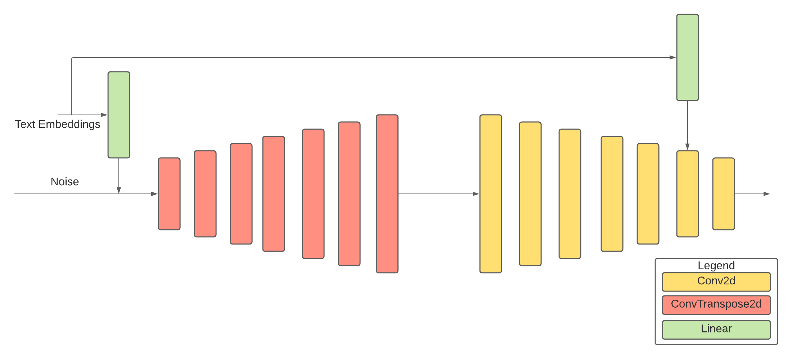

# Deep Convolutional Generative Adversarial Network

The generator of the DCGAN encodes the text embeddings with the help of a fully connected layer. The outputs from the fully connected layer are then concatenated with the noise vector and reshaped into a vector of shape (|B|, 356, 4, 4). The concatenated vector is then passed through a set of transposed convolutional layers that allows this output vector to be upsampled into an image of size 128x128. The discriminator consists of convolutional layers that are responsible for downsampling the image. The text embeddings are passed to a fully connected layer, expanded and then concatenated with the outputs of the second layer. This concatenated output is then passed to the final layer of the discriminator, producing outputs ranging from 0 to 1. The learning rates for the generator and the discriminator are 0.0002 and 0.0001 respectively. The Adam optimizer for the generator as well as the discriminator is set with 𝛽1 = 0.5 and 𝛽2 = 0.5.

---

## Notebooks and Scores

|        | Colab Link     | Inception Score     | Fréchet Inception Distance     | Clean FID     |
| ------------- |-------------| -------------| -------------| -------------|
| 1 Caption |  | 2.840 ± 0.062 | 87.146 | 87.580 |
| 5 Caption |  | 2.732 ± 0.055 | 90.268 | 90.331 |