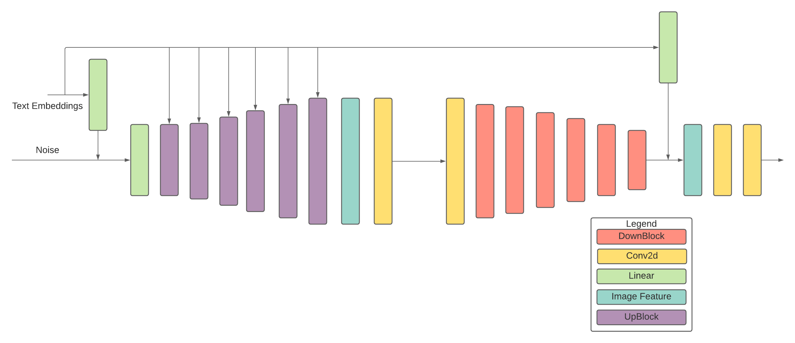

# Deep Fusion Generative Adversarial Network

The architecture of the DFGAN that we have used for training is very similar to the one used by the authors of this network. However, the images generated are of size 128x128. In order to accommodate this reduced image size, the last block of the generator and the discriminator responsible for the generation and validation of 256x256 sized images have been omitted. A matching aware gradient policy was added to the discriminator which helped in improving the quality of the final image. For the DFGAN, the Adam optimizer is set to 𝛽1 = 0 and 𝛽2 = 0.9 and the learning rates for the generator and discriminator are 0.0001 and 0.0004 respectively.

---
## Notebooks and Scores

|        | Colab Link     | Inception Score     | Fréchet Inception Distance     | Clean FID     |
| ------------- |-------------| -------------| -------------| -------------|
| 1 Caption |  | 2.865 ± 0.041 | 109.140 | 106.453 |
| 5 Caption |  | 3.455 ± 0.075 | 88.748 | 87.462 |