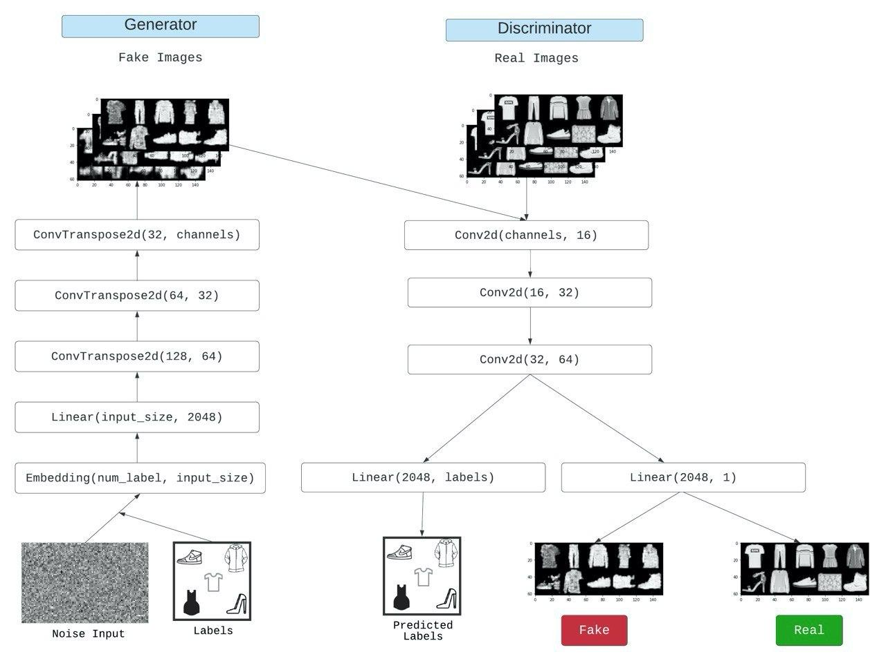

# Auxillary Classifier Generative Adversarial Network (ACGAN)

### What are ACGANs?
The ACGAN like any normal GAN consists of a generator and a discriminator. However, in ACGANs, every generated sample has a corresponding class label (that belongs to the available classes) in addition to the noise. This class label helps the model to generate images based on the label given.

The architecture of the generator in ACGAN is similar to that of the cGAN, however the main difference is in the discriminator model, which is only provided with the image as input, unlike the cGAN that is provided with the image and class label as input. The discriminator model must then predict whether the given image is real or fake as before, and must also predict the class label of the image.

### ACGANs architecture

### References
 - [Conditional Image Synthesis With Auxiliary Classifier GANs](https://arxiv.org/pdf/1610.09585.pdf)
 - [How to Develop an Auxiliary Classifier GAN (AC-GAN) From Scratch with Keras](https://machinelearningmastery.com/how-to-develop-an-auxiliary-classifier-gan-ac-gan-from-scratch-with-keras/)
 - [Pytorch ACGAN](https://github.com/eriklindernoren/PyTorch-GAN/blob/master/implementations/acgan)

