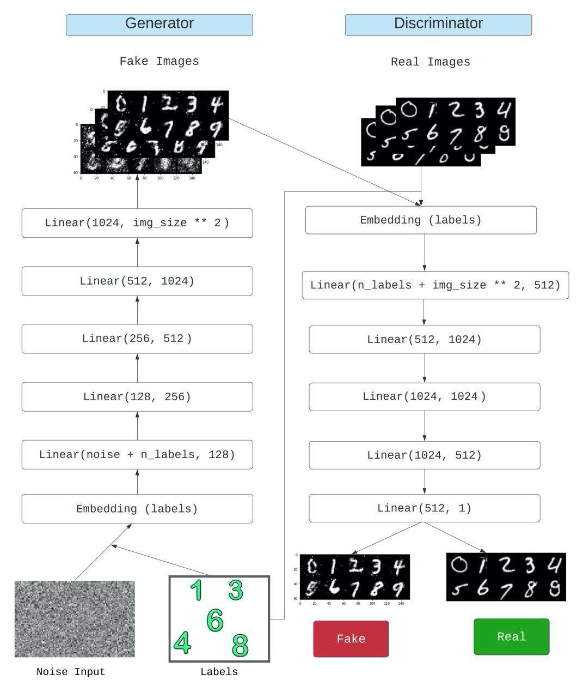

# Conditional Generative Adversarial Network (cGAN)

### What are cGANs?
Conditional GAN is a generative adversarial network whose Generator and Discriminator are conditioned during training by using some additional information. This auxiliary information could be, in theory, anything, such as a class label, a set of tags, or even a written description. 

During CGAN training, the Generator learns to produce realistic examples for each label in the training dataset, and the Discriminator learns to distinguish fake example-label pairs from real example-label pairs.

### CGANs architecture

### References
 - [Conditional Generative Adversarial Nets](https://arxiv.org/pdf/1411.1784.pdf)
 - [Pytorch cGAN](https://github.com/eriklindernoren/PyTorch-GAN/tree/master/implementations/cgan)

