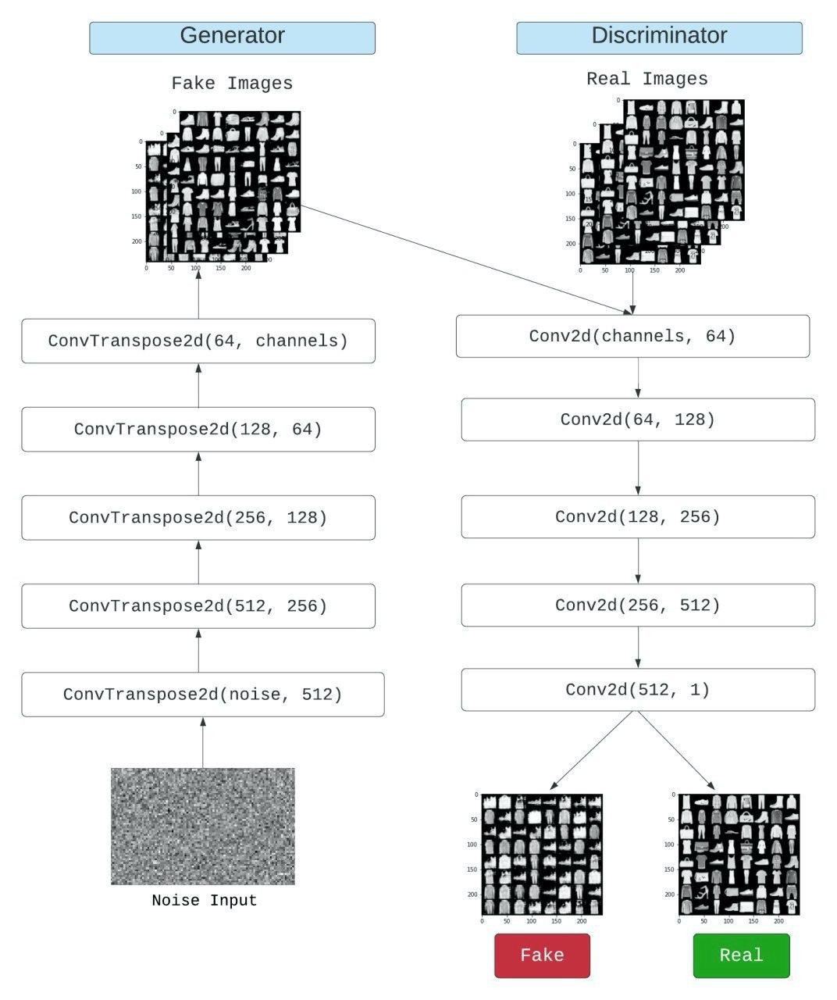

# Deep Convolutional Generative Adversarial Networks (DCGANs)

### What are DCGANs?
Radford, et al. (2016) wrote a paper - Unsupervised Representation Learning with Deep Convolutional Generative Adversarial Networks which was inspired from GANs.

DCGANs are a class of convolutional GANs, where both the generator and discriminator networks are comprised of convolutional neural networks (CNNs).

### DCGAN architecture

Similar to a GAN, the DCGAN contains two models:

 1. The Generator Model:
	 - It consists of Transposed CNNs and Batch Normalization layers, alternating with each other.
	 - ReLU activation is used for all the layers except the final one, where Tanh (tanh gives output in the range [-1, 1]) is used.
2. The Discriminator Model:
	- The Discriminator consists of CNNs and Batch Normalization layers, alternating with each other.
	- Leaky ReLU with a slope of 0.2 is used for all the layers expect the final one, where Sigmoid (sigmoid gives output in the range [0, 1]) is used.

### Training a DCGAN
Finally, now that we have all of the parts of the GAN framework defined, we can train it. However, training GANs is somewhat of an art form, as incorrect hyperparameter settings lead to mode collapse with little explanation of what went wrong.

### References
- [Unsupervised Representation Learning with Deep Convolutional Generative Adversarial Networks.](https://arxiv.org/abs/1511.06434)
- [Understanding Deep Convolutional GANs with a PyTorch implementation.](https://iq.opengenus.org/deep-convolutional-gans-pytorch/)
- [PyTorch DCGAN tutorial.](https://pytorch.org/tutorials/beginner/dcgan_faces_tutorial.html)
