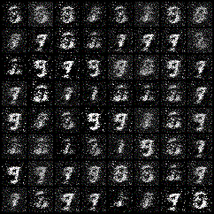
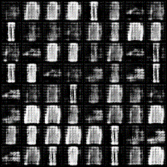
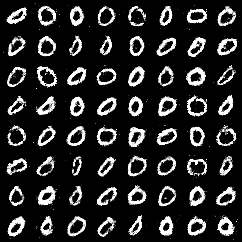
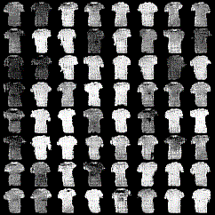

# FashionMNIST and DigitMNIST

## Our implementations.

We have implemented different GAN variations on the MNIST dataset on our path to Text-to-Image Synthesis.

**Listed below are the different implementations:**

 - [GAN](GAN)
 

 

 
 ___
 
 - [DCGAN](DCGAN)
 
  
 
 
 
 ___
 
 - [cGAN](CGAN)

 
 
 ___

 - [ACGAN](ACGAN)

 
