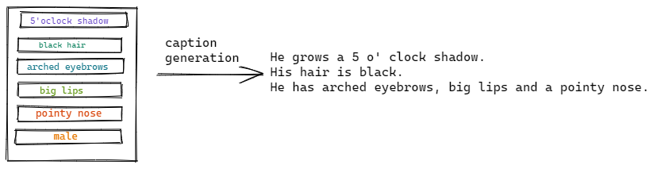

# Face Generation from Textual Description using Generative Adverserial Networks 📝  2️⃣ 👧👱
[:link:](http://www.ekkm.xyz/))

🔹 [Motivation](#motivation)

🔹 [Progress Ladder](#progress-ladder)

🔹 [Results](#results)

🔹 [Future Scope](#future-scope)

🔹 [Reference Papers](#reference-papers)

## Motivation  

Powerful Generative Adverserial Networks have been used in the past to automatically synthesize realistic images from text. However, these existing tasks have been used for simpler tasks such as flowers and birds.
So, our aim is to focus on a less addressed domain of face generation from fine-granined textual description of faces.

As we are still undergrad students, we decided to not only build our main GAN, but also a ladder of GANs that helped strengthen our understanding, in hopes to inspire others.

## Progress Ladder 

### Step 1. We Started With Simple GANs On The MNIST Digit Dataset🔢

🔗 [Code, References and Output](https://github.com/kad99kev/Face-Generator/tree/master/MNIST-GANs/GAN)

### Step 2. Progressed Our Way Up To Understanding Other GAN Architectures On The Digit and Fashion MNIST Datasets. 👗 👕

🔗 [Deep Convolution GANS - Code, References and Output](https://github.com/kad99kev/Face-Generator/tree/master/MNIST-GANs/DCGAN)

🔗 [Conditional GANS - Code, References and Output](https://github.com/kad99kev/Face-Generator/tree/master/MNIST-GANs/CGAN)

🔗 [Auxillary Conditional GANS - Code, References and Output](https://github.com/kad99kev/Face-Generator/tree/master/MNIST-GANs/ACGAN)

We documented our losses and make a report of our learnings using **Weights & Biases ✨**. The report can be found [here](https://wandb.ai/kad99kev/mnist-gans/reports/MNIST-GANs--VmlldzoyMTE4NzE).

### Step 3. Researched About Past Implementations On The Topic
(Some of the research paper links)

* [FTGAN : A fully Generative Adverserial Network for Text to Face Generation](https://arxiv.org/pdf/1904.05729.pdf)
* [Text2FaceGAN : Face Generation from Fine Grained Description](https://arxiv.org/pdf/1911.11378.pdf) 
* [Generative Adverserial Text to Image Synthesis](https://arxiv.org/pdf/1605.05396.pdf)

### Step 4. Created A Meaningful Text Dataset Using Celeb-A

Here, the challenege faced was to create meaningful sentences using a mutli-labelled dataset. We considered the following 6 cateogeries:

  🔸 The structure of the face
  
  🔸 The facical hairstyle the person sports
  
  🔸 The description of other facical features
  
  🔸 The hairstyle of the person
  
  🔸 Attributes that enhance his appearance
  
  🔸 Accessories worn (if any)
  
  An example of one of the sentences from the dataset
   
  
  ### Step 5. Created A Pipeline To Try Out Different Architectures
  P.S We've added some of our notebooks. While our work is far from perfect we'd appreciate if you check them out and give valuable feedback.
  :white_small_square: [DCGANS with Skip thought embeddings](https://colab.research.google.com/drive/1JDNojILmxeF5nUkYeNe6xank2gfvVML6?usp=sharing)
  :white_small_square: [DCGANS with BERT embbeddings](https://colab.research.google.com/drive/1J4tdVVluwmij9jPvtKTaBd7cQZp6FDr1?usp=sharing)
  :white_small_square: [HDGANS with BERT embeddings](https://colab.research.google.com/drive/1dWGRdtlqrvCt9OUX8Y1f0SjjHEIxI2Uo?usp=sharing)

### Step 6. Created A Streamlit Application To Showcase Our Work
Check it out [here](http://www.ekkm.xyz/)

The code for the same can be found [here](https://github.com/kad99kev/FGTD-Streamlit)

## Results
 

## Future Scope
1. We did try self attention along with spectral normalization, however the results obtained were not upto expectations. However, we still believe this avenue could potentially lead to better results.

2. Using a Progressive or Hierarchical structure gave promising results, however it also consumes a lot of resources at the same time often leading to CUDA out of resource errors.

## Reference Papers

* [FTGAN : A fully Generative Adverserial Network for Text to Face Generation](https://arxiv.org/pdf/1904.05729.pdf)
* [Text2FaceGAN : Face Generation from Fine Grained Description](https://arxiv.org/pdf/1911.11378.pdf) 
* [Generative Adverserial Text to Image Synthesis](https://arxiv.org/pdf/1605.05396.pdf)
* [StackGAN: Text to Photo-realistic Image Synthesis with Stacked Generative Adversarial Networks](https://arxiv.org/pdf/1612.03242.pdf)
* [Skip-Thought Vectors](https://arxiv.org/pdf/1506.06726.pdf)

